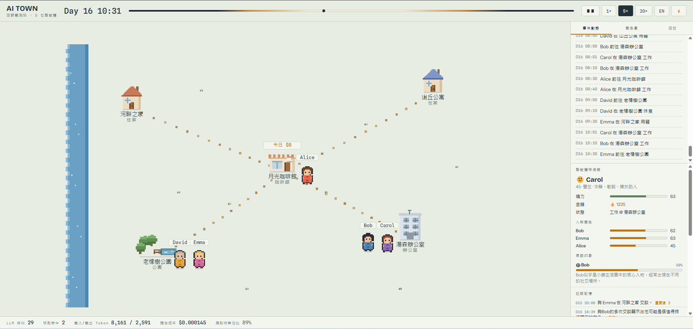

# 高柏小鎮 · Gaobo Town

A generative multi-agent social simulation with a pixel-art town UI. Ten LLM-driven
residents follow daily routines, talk, gossip, keep secrets, fall in and out of love,
change careers — and you watch it unfold, rewind it, or nudge it as a god.



- **Emergent social drama, not scripted.** Plant a rumor and watch it spread
  mouth-to-mouth, distort in the retelling, erode trust, drive customers away from a
  shop, and end in an on-map confrontation that finally settles it. Plant a secret and
  watch it get confided, betrayed, and leaked into a rumor.
- **Free by default, cheap when paid.** A deterministic mock provider runs the whole
  town with no API key, and ~95% of decisions are resolved by rules before any model is
  touched. Real models are opt-in: a free tier (Groq → Gemini → OpenRouter → mock) or a
  paid-first config (DeepSeek + Kimi ahead of the free layer) — both degrade to the same
  mock floor.
- **It remembers, and it replays.** Optional Postgres + pgvector persistence snapshots
  the whole world so a restarted server resumes mid-day; a replay mode scrubs back
  through recorded history on the same map, and the Beta-era town is archived and
  replayable.
- **Agents that form impressions.** Semantic memory distils repeated experience into
  lasting beliefs (with confidence and decay) that bend future dialogue and give
  relationships inertia.

---

## The town

Ten residents, each a profile of age, occupation, traits, a **speech style**, a fixed
**gender**, and a **romantic orientation / inclination** that shapes who they might fall
for. Seven locations — two homes, a cafe, a bakery, a market, an office, and a park —
with routines engineered so paths cross and encounters happen on their own. A repair
technician is dispatched when equipment breaks; a light installation in the park is a
landmark one resident slowly builds.

## Features

**Simulation core**
- Event-driven scheduler — each agent has a next-decision minute; the clock jumps
  straight to the next one, so sleeping agents cost zero compute.
- 4-level decision funnel (rules → cheap → normal → smart LLM); ~95% of decisions never
  reach a model.
- **Non-blocking dialogue & reflection** — the slow LLM generation runs in a background
  task while the rest of the town keeps moving; only the two speakers freeze until it
  settles. Bounded by per-provider timeouts, a stuck-conversation watchdog, and
  concurrency semaphores.
- **Automatic day/night pacing** — real-time by day; once the whole town is asleep the
  clock cruises through the night and restores at dawn. No manual speed tiers.
- **Resilience** — every synchronous per-tick LLM call has a timeout, so one wedged
  provider can't freeze the pacing loop; a WebSocket broadcast can't be stalled by a
  frozen browser tab; a heartbeat + stall watchdog make any hang self-locating in the log.

**Social systems**
- **Rumors** — full lifecycle: seed → two-way spread → distortion in the retelling →
  relationship damage → seek-out & face-to-face confrontation → resolution (a resolved
  rumor stops propagating).
- **Secrets** — a private worry is confided to a trusted friend (trust-gated), may be
  betrayed and leaked into a third-person rumor, can be confronted, and is eventually
  *laid to rest* — which rewrites the owner's goals.
- **Romance** — an independent track: warm exchanges grow attraction, a crush can become
  a quietly-kept secret, and a confession lands as acceptance or a gentle rejection,
  scaled by each agent's orientation toward the other.
- **Life transitions** — reflection can resolve, over many days, into a real change:
  quitting a job, taking one at the cafe or bakery, going freelance — with wages that
  actually transfer between employer and staff.
- **Relationships** — friendship / trust / conflict updated from conversation signals in
  Python, with milestones, daily conflict decay, and belief inertia (a bad impression is
  slow to repair, quick to sour).
- **Economy** — daily wages, cafe/bakery/market revenue, rumor-driven customer loss, a
  paid repair dispatch, and a **weekly cycle**: shops take days off, and books settle at
  the week's close.

**World**
- Day/night cycle (map tints, windows glow, a night-cruise moon indicator).
- Weather, park festivals, and equipment breakdowns as God-Mode world effects that
  reshape where agents go.

**LLM infrastructure**
- 3-tier task routing (cheap / normal / smart) assembled dynamically from whatever keys
  exist, with a per-task language-aware override.
- **Free tier**: Groq → Gemini → OpenRouter → mock floor. **Paid-first** (`AI_TOWN_PAID`):
  DeepSeek-v4-flash and Kimi-K2.6 (via OpenRouter) ahead of the free layer, so a paid run
  never touches the free 20/day quota before it must.
- **Universal output validation at the router** — every provider's JSON is held to a
  quality gate (a bare "ok" dodge, empty text, truncated JSON, CJK gibberish), plus a
  **referential-integrity gate** on dialogue (anchored pronouns, no self-third-person)
  and a **global gender roster** on every free-text prompt so pronouns never drift.
- **Patient retry over canned filler** — dialogue and reflection run "no floor": a
  whole-chain failure brews a short pause and re-runs rather than shipping a mock line;
  retry/floor rates are exposed in `/api/usage`.
- 429 cooldowns, a per-sim-day dialogue cap, and a budget guard that collapses to
  free/mock when the spend cap is hit.

**Persistence** (optional — set `AI_TOWN_DB_URL`)
- Postgres + pgvector: runs, events, memories (vector retrieval), the LLM cost ledger,
  per-run world snapshots, pre-operation archive backups, and a **persistent translation
  cache** (translate once, keep forever — no re-translation storm on restart).
- World snapshot & resume — a restarted (or crashed) server continues where it left off.
- Replay — pick a past run, drag a timeline, and re-stage its history on the map; runs
  from an older cast fall back to a text-only timeline.

**UI** (single HTML file, no build step)
- Pixel-art village with animated villagers, a live WebSocket event feed, and multi-line
  speech bubbles.
- **Floating, draggable windows** — an agent inspector (energy, money, relationships,
  lasting impressions, recent memories, decision traces) and secrets / rumors
  observatories.
- **Chronicle** — the town's living history, pinned atop the feed; entries expand into
  the actual dialogue said around a beat, with a jump-to-replay button.
- **Relationship graph** — a self-written force layout with a romance overlay, per-stage
  edge filter, ego (focus) view, and drag-to-pin nodes.
- Feed scroll-lock + quiet filter, a God-Mode panel (rain / festival / equipment fault /
  rumor seeding / secret planting), full zh-TW ⇄ English i18n with a display-layer
  translation cache and an "in-progress" hint, and a live cost strip.

---

## Quick start

No dependencies, no API key — the built-in mock provider runs everything for free.

**Headless one-day simulation:**

```bash
python scripts/run_day.py              # deterministic mock, prints the day's events
python scripts/run_day.py --traces 8   # also print N decision traces
python scripts/run_day.py --live       # force real providers regardless of AI_TOWN_LIVE
```

**Live town UI:**

```bash
pip install -r requirements.txt
uvicorn backend.app.server:app         # from the repo root, then open http://localhost:8000
```

Pacing is automatic — real time by day, fast-forward through the night. Controls: pause,
language toggle, and the ⚡ God-Mode panel. Click any agent to open the inspector; use the
🤫 / 🗣️ icons for the secrets / rumors windows. The sim auto-suspends when no browser is
connected, so an idle tab costs nothing.

### Configuration (`.env` in the repo root)

Everything is optional; with nothing set, the app runs on the mock provider, in memory.

| Variable | Purpose | Default |
|---|---|---|
| `AI_TOWN_LIVE` | `1` = use real LLM providers instead of the mock | unset (mock) |
| `AI_TOWN_PAID` | `1` = paid-first chains (DeepSeek + Kimi ahead of the free layer); needs `OPENROUTER_API_KEY` | unset |
| `GROQ_API_KEY` | Groq free tier (fast cheap/structured tasks) | — |
| `GEMINI_API_KEY` | Gemini free tier (normal tier; zh dialogue) | — |
| `OPENAI_API_KEY` | OpenAI models (optional, paid) | — |
| `OPENROUTER_API_KEY` | OpenRouter (free fallback, and the paid DeepSeek/Kimi front) | — |
| `OPENROUTER_MODEL` | OpenRouter model for English + structured tasks | `openrouter/free` (auto-router) |
| `OPENROUTER_MODEL_ZH` | Chinese-capable free model on the zh chain tail; blank to disable | `google/gemma-4-26b-a4b-it:free` |
| `AI_TOWN_TRANSLATE_MODEL` | Paid translator at the front of the translate chain | `deepseek/deepseek-v4-flash` |
| `AI_TOWN_ZH_SECOND_MODEL` | Second paid model on the zh free-text chains | `moonshotai/kimi-k2.6` |
| `AI_TOWN_LANG` | Generation + UI default language (`en` / `zh-tw`) | `en` |
| `AI_TOWN_DIALOGUE_CAP` | Max conversations per sim-day (live only; `0` = unlimited) | `25` |
| `AI_TOWN_BUDGET_USD` | Spend cap; providers collapse to free/mock when reached (`≤0` disables) | `1.0` |
| `AI_TOWN_DB_URL` | Postgres + pgvector persistence (`postgresql+asyncpg://…`); unset = in-memory | unset |
| `AI_TOWN_RESUME` | `0` = ignore the last snapshot and start at Day 1 (needs a DB) | `1` |

<details><summary>Pacing &amp; resilience tuning knobs</summary>

| Variable | Purpose | Default |
|---|---|---|
| `AI_TOWN_DAY_SPEED` | Daytime speed (sim-minutes per real second) | `1` |
| `AI_TOWN_NIGHT_SPEED` | Night fast-forward cruise speed | `20` |
| `AI_TOWN_UNATTENDED` | `1` = keep running with nobody watching (cruise + record) | `0` |
| `AI_TOWN_UNATTENDED_SPEED` | Cruise speed while unattended | `2` |
| `AI_TOWN_SYNC_CALL_TIMEOUT` | Per-provider timeout (s) for in-tick cheap calls | `10` |
| `AI_TOWN_DIALOGUE_PROVIDER_TIMEOUT` | Per-provider timeout (s) for dialogue | `60` |
| `AI_TOWN_DIALOGUE_RETRY_ROUNDS` / `_WAIT` | Patient-retry rounds / brew (s) for dialogue | `2` / `30` |
| `AI_TOWN_REFLECT_RETRY_ROUNDS` / `_WAIT` | Patient-retry rounds / brew (s) for reflection | `2` / `20` |
| `AI_TOWN_TRANSLATE_RETRY_MAX` / `_WAIT` | Background translation retries / wait (s) | `3` / `30` |
| `AI_TOWN_GATE_DIAG` | `1` = log gate rejections (over-kill / referential / model attribution) | unset |

</details>

---

## Architecture

```
backend/app/
├── server.py            FastAPI + WebSocket shell, REST API, God Mode, replay, admin, pacing loop
├── simulation/
│   ├── engine.py        event-driven scheduler, clock, daily/weekly settlement, background tasks
│   └── snapshot.py      world serialization for snapshot & resume
├── world/world.py       locations, occupancy, observation, Level-0 execution, economy
├── social/
│   ├── rumors.py        rumor registry + version chains (the telephone game)
│   └── secrets.py       secret registry — confide, leak, resolution lifecycle
├── agents/
│   ├── core.py          state, episodic memory (top-k / vector), semantic memory (beliefs)
│   ├── agent.py         Agent = profile + state + memory + routine + relationships
│   ├── routine.py       daily/weekly routines (Level 0 — kills most LLM calls)
│   ├── romance.py       the romance track (eligibility, growth, orientation bias)
│   ├── transitions.py   life-change templates (quit / hire / freelance)
│   └── decision.py      4-level funnel, conversations, reflection, quality + referential gates
├── llm/
│   ├── factory.py       provider chains from env (mock / free / paid-first, language-aware)
│   ├── router.py        task→tier routing, decision cache, fallback, cooldown, budget, output gate
│   ├── usage.py         the cost ledger
│   ├── embeddings.py    embedding provider (mock / pluggable)
│   ├── env.py           zero-dependency .env loader
│   ├── prompts/builders.py   lean context builders, name & gender rosters
│   └── providers/       mock, groq, gemini, openai, openrouter
└── db/
    ├── models.py        runs, events, memories (pgvector), llm_calls, snapshots, archive, translation_cache
    └── persistence.py   async write queue, vector retrieval, snapshots, replay reads, translation cache
data/seed.py             10 residents, 7 locations, routines engineered to cause encounters
scripts/run_day.py       headless one-day runner
frontend/index.html      single-file town UI (map, feed, chronicle, graph, inspector, observatories)
docs/                    event-contract.md, admin.md, deploy.md, formal-server-checklist.md
```

**Cost-control philosophy.** The LLM is treated as the expensive part and used as a last
resort. An event-driven scheduler means idle agents cost nothing; a rules-first funnel
resolves routine behaviour without a model; a conversation is one JSON call, not one per
turn; a decision cache makes repeated situations free; cheap models handle the common
tiers and the smart tier is reserved for reflection; and at night an all-asleep town
makes zero calls. A measured headless one-day run resolves **~95% of decisions by rules**
(100/105 and 115/119 in two runs) with roughly a dozen model calls, and all relationship
math stays in Python — the model only ever emits signals, never final numbers. On the paid-first
config the models are cheap (DeepSeek-v4-flash), so an actively-watched day costs on the
order of cents; the budget guard caps it hard.

---

## Docs

- [`docs/event-contract.md`](docs/event-contract.md) — the structured Event Contract every
  UI and the database render from.
- [`docs/deploy.md`](docs/deploy.md) — container deployment (Railway / Fly.io) and
  Supabase + pgvector setup for persistence, snapshot & resume.
- [`docs/admin.md`](docs/admin.md) — the dry-run-by-default admin endpoints (prune beliefs,
  resolve stale secrets) and their pre-operation snapshot backups.
- [`docs/formal-server-checklist.md`](docs/formal-server-checklist.md) — design decisions
  of record for the formal-server town.

## Roadmap

- One-command cloud deployment (Dockerfile + Compose exist; see `docs/deploy.md`).
- Multi-agent LLM batching to cut wall-clock during busy stretches.
- A richer economy and more world events.

## Acknowledgments

Inspired by Stanford's [Generative Agents](https://arxiv.org/abs/2304.03442) and
DeepMind's [Concordia](https://github.com/google-deepmind/concordia).
